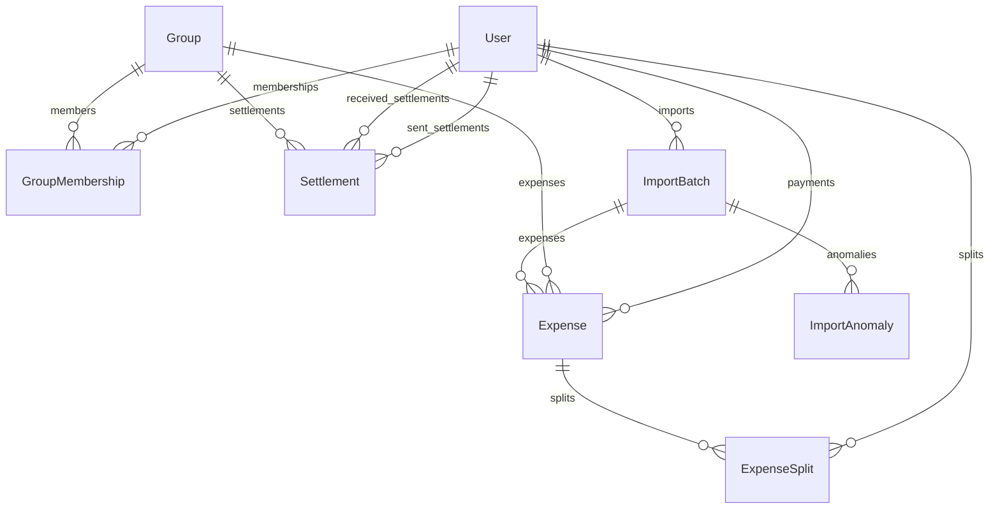

# Scope & Specifications — Shared Flatmate Expenses App

This document outlines the database schema and the 22-anomaly catalog that forms the specification of the Shared Flatmate Expenses App.

## Database Schema (Relational Model)

### Table Definitions

#### `users`
- `id`: Int / UUID (Primary Key)
- `name`: String (Unique)
- `email`: String (Unique)
- `password_hash`: String
- `created_at`: DateTime (Default: now)

#### `groups`
- `id`: Int / UUID (Primary Key)
- `name`: String
- `created_by`: Int / UUID (Foreign Key -> `users.id`)
- `created_at`: DateTime (Default: now)

#### `group_memberships`
- `id`: Int / UUID (Primary Key)
- `group_id`: Int / UUID (Foreign Key -> `groups.id`)
- `user_id`: Int / UUID (Foreign Key -> `users.id`)
- `joined_at`: DateTime
- `left_at`: DateTime (Nullable)
- *Note: Multiple rows are allowed for the same `(group_id, user_id)` to handle non-continuous membership.*

#### `expenses`
- `id`: Int / UUID (Primary Key)
- `group_id`: Int / UUID (Foreign Key -> `groups.id`)
- `paid_by`: Int / UUID (Foreign Key -> `users.id`)
- `description`: String
- `amount`: Decimal
- `currency`: String (e.g. 'INR', 'USD')
- `exchange_rate_to_inr`: Decimal (Nullable)
- `amount_in_inr`: Decimal
- `split_type`: Enum (`equal`, `percentage`, `share`, `exact`)
- `expense_date`: DateTime
- `created_at`: DateTime (Default: now)
- `is_settlement`: Boolean (Default: false)
- `source`: String (Default: 'manual') -- 'manual' | 'import'
- `import_batch_id`: Int / UUID (Nullable, Foreign Key -> `import_batches.id`)

#### `expense_splits`
- `id`: Int / UUID (Primary Key)
- `expense_id`: Int / UUID (Foreign Key -> `expenses.id`)
- `user_id`: Int / UUID (Foreign Key -> `users.id`)
- `share_amount`: Decimal (in INR)
- `share_value`: Decimal (raw value in original currency before conversion)
- `created_at`: DateTime (Default: now)

#### `settlements`
- `id`: Int / UUID (Primary Key)
- `group_id`: Int / UUID (Foreign Key -> `groups.id`)
- `paid_by`: Int / UUID (Foreign Key -> `users.id`)
- `paid_to`: Int / UUID (Foreign Key -> `users.id`)
- `amount`: Decimal (in INR)
- `currency`: String (Default: 'INR')
- `settled_date`: DateTime
- `note`: String (Nullable)
- `created_at`: DateTime (Default: now)

#### `import_batches`
- `id`: Int / UUID (Primary Key)
- `filename`: String
- `imported_by`: Int / UUID (Foreign Key -> `users.id`)
- `imported_at`: DateTime (Default: now)
- `status`: String -- 'pending_review' | 'completed' | 'failed'
- `raw_data`: JSON -- stores raw rows and staging values

#### `import_anomalies`
- `id`: Int / UUID (Primary Key)
- `import_batch_id`: Int / UUID (Foreign Key -> `import_batches.id`)
- `row_reference`: Int -- line number in the source CSV
- `anomaly_type`: String (e.g. '#1', '#2'...)
- `description`: String
- `raw_data`: JSON -- raw CSV row values
- `action_taken`: String (Nullable)
- `requires_approval`: Boolean
- `approved_by`: Int / UUID (Nullable, Foreign Key -> `users.id`)
- `approved_at`: DateTime (Nullable)
- `resolution_status`: String -- 'auto_handled' | 'pending_approval' | 'approved' | 'rejected'

---

## Anomaly Catalog (Confirmed from `expenses_export.csv`)

| # | Anomaly Name | Description | Detection Rule | Policy | Action Type |
|---|---|---|---|---|---|
| **#1** | Exact duplicate expense | Identical expense logged twice (rows 5 & 6) | Matching payee, amount, currency, date, splits, and fuzzy-matched descriptions. | Keep first occurrence, drop second. | `requires_approval` |
| **#2** | Comma-formatted amount | `"1,200"` format (row 7) | Amount contains commas but parses as number after stripping them. | Strip commas. | `auto_handled` |
| **#3** | Inconsistent name casing | `"priya"` instead of `"Priya"` (row 9) | Case-insensitive match on group members. | Normalize to canonical casing. | `auto_handled` |
| **#4** | Excess decimal precision | `899.995` INR (row 10) | More than 2 decimal places. | Round to 2 decimals (round half-up). | `auto_handled` |
| **#5** | Name variant with extra characters | `"Priya S"` (row 11) | Fuzzy/prefix match on member names. | Normalize to `"Priya"`. | `auto_handled` |
| **#6** | Non-standard split_type | `"unequal"` (row 12) | Split type not in canonical enum. | Map `"unequal"` -> `"exact"`. | `auto_handled` |
| **#7** | Missing payer | Blank `paid_by` (row 13) | `paid_by` is empty/null. | Stage row; require human to assign. | `requires_approval` |
| **#8** | Settlement as expense | Settlement logged in CSV (row 14) | Blank split type + single split name + payment description. | Reclassify to `settlements` table. | `auto_handled` |
| **#9** | Percentages sum to 110% | Pizza and brunch totals (rows 15 & 32) | Split percentages sum to value != 100%. | Normalize proportionally (divide by sum of %). | `requires_approval` |
| **#10** | Foreign currency, no rate | USD rows with no rate (rows 20, 21, 23, 26) | `currency != 'INR'` and rate is null. | Prompt for a single rate for batch. | `requires_approval` |
| **#11** | Non-member guest | `"Dev's friend Kabir"` in splits (row 23) | Name in split not matching group members. | Auto-create guest member on split date. | `auto_handled` |
| **#12** | Conflicting duplicates | Same event, different details (rows 24 & 25) | Same date + overlapping splits + similar desc, but amount/payer differ. | Review side-by-side; human picks one. | `requires_approval` |
| **#13** | Negative amount | `"-30 USD"` (row 26) | Amount is negative. | Treat as refund (negative splits). | `auto_handled` |
| **#14** | Non-standard date format | `"Mar-14"` missing year (row 27) | Date does not match `DD-MM-YYYY`. | Infer year from surrounding rows. | `auto_handled` |
| **#15** | Name trailing whitespace | `"rohan "` (row 27) | Name field contains trailing spaces. | Trim whitespace and normalize. | `auto_handled` |
| **#16** | Missing currency | Blank currency (row 28) | Currency field is empty. | Default to `'INR'`. | `auto_handled` |
| **#17** | Zero-amount expense | Swiggy order amount = 0 (row 31) | Amount is exactly 0. | Import with zero splits for auditing. | `auto_handled` |
| **#18** | Ambiguous date format | `"04-05-2026"` (row 34) | Both day and month $\le$ 12. | Prompt user to select DD-MM vs MM-DD. | `requires_approval` |
| **#19** | Departed member split | Meera included after leaving (row 36) | Split member left group before date. | Remove departed member, recompute splits. | `requires_approval` |
| **#20** | Inconsistent split info | `equal` split type with details (row 42) | Split type is equal but splits details non-empty. | If details match equal shares, import. | `auto_handled` |
| **#21** | Personal transfer in CSV | Deposit paid directly to user (row 38) | Splits contain exactly 1 user (not payer). | Reclassify to `settlements`. | `requires_approval` |
| **#22** | Non-contiguous guest visits | Dev's two separate visits | Multi-visit detection. | Create two distinct membership windows. | `auto_handled` |
